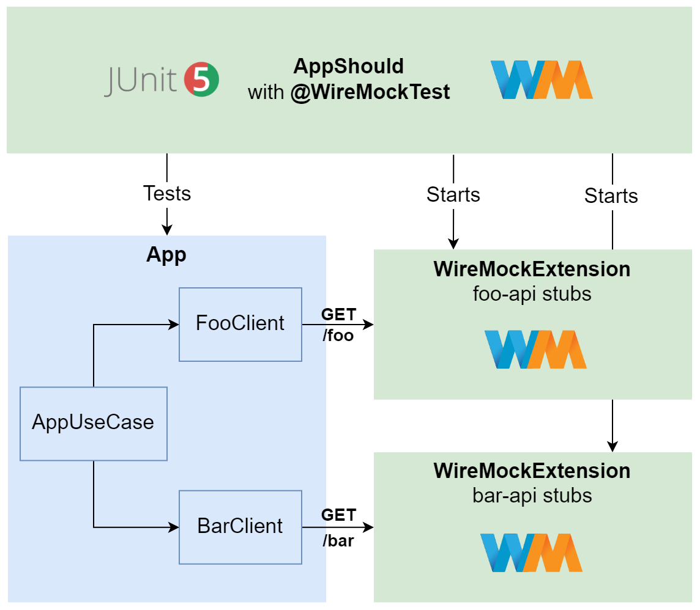

[](https://github.com/rogervinas/wiremock-testing/actions/workflows/ci.yml)


# WireMock Testing

[WireMock](https://wiremock.org/) is a great library to mock APIs in your tests and supports [Junit5](https://wiremock.org/docs/junit-jupiter/) with two modes:
- Declarative with **@WireMockTest**
- Programmatic with **WireMockExtension**

And **WireMock** also has:
- A [Docker image](https://hub.docker.com/r/wiremock/wiremock)!
- A [Testcontainers module](https://wiremock.org/docs/solutions/testcontainers/)!

(you can also check [other supported technologies](https://wiremock.org/docs/#:~:text=By%20technology))

But "talk is cheap, show me the code [...](https://www.goodreads.com/quotes/437173-talk-is-cheap-show-me-the-code#:~:text=Quote%20by%20Linus%20Torvalds%3A%20%E2%80%9CTalk,Show%20me%20the%20code.%E2%80%9D)" 😮

Ok so let's implement first the scenario with **@WireMockTest**:



And later the one with [@Testcontainers](https://testcontainers.com/) and these two alternatives:
1. Generic [Compose Testcontainers module](https://java.testcontainers.org/modules/docker_compose/#compose-v2) using [official WireMock's docker image](https://hub.docker.com/r/wiremock/wiremock)
2. [WireMock's Testcontainers module](https://wiremock.org/docs/solutions/testcontainers/)


* [BarClient](#barclient)
  * [BarClient interface](#barclient-interface)
  * [BarKtorClient test](#barktorclient-test)
  * [BarKtorClient implementation](#barktorclient-implementation)
* [FooClient](#fooclient)
  * [FooClient interface](#fooclient-interface)
  * [FooKtorClient test](#fooktorclient-test)
  * [FooKtorClient implementation](#fooktorclient-implementation)
* [AppUseCase](#appusecase)
* [App](#app)
  * [App implementation](#app-implementation)
  * [App test with @WireMockTest](#app-test-with-wiremocktest)
  * [App test with WireMockExtension](#app-test-with-wiremockextension)
  * [App test with Compose Testcontainers module](#app-test-with-compose-testcontainers-module)
    * [Static stubs](#static-stubs)
    * [Dynamic stubs](#dynamic-stubs)
  * [App test with WireMock Testcontainers module](#app-test-with-wiremock-testcontainers-module)
  * [App run with WireMock container and Docker Compose](#app-run-with-wiremock-container-and-docker-compose)
* [Test this demo](#test-this-demo)
* [Run this demo](#run-this-demo)

## BarClient

### BarClient interface

```kotlin
interface BarClient {
  fun call(name: String): String
}
```

### BarKtorClient test

I will use a [Ktor client](https://ktor.io/docs/client.html) for no other reason that I need an Http client and this seems interesting, as we are using **Kotlin**.

So a simple **@WireMockTest** for the **BarKtorClient** looks like:

```kotlin
@WireMockTest
class BarKtorClientShould {

 private val name = "Sue"
 
 @Test
 fun `call bar api`(wm: WireMockRuntimeInfo) {
  stubFor(
   get(urlPathMatching("/bar/$name"))
   .willReturn(ok().withBody("Hello $name I am Bar!"))
  )

  assertThat(
    BarKtorClient(wm.httpBaseUrl).call(name)
  ).isEqualTo("Hello $name I am Bar!")
 }

 @Test
 fun `handle bar api server error`(wm: WireMockRuntimeInfo) {
  stubFor(
   get(urlPathMatching("/bar/.+"))
   .willReturn(serverError())
  )

  assertThat(BarKtorClient(wm.httpBaseUrl).call(name))
   .startsWith("Bar api error: Server error")
 }
}
```

### BarKtorClient implementation

In order to make the test pass 🟩 we can implement the **BarKtorClient** this way:

```kotlin
class BarKtorClient(private val url: String) : BarClient {

 private val client = HttpClient(CIO) {
   expectSuccess = true
 }

 override fun call(name: String): String = runBlocking {
  try {
   client.get("$url/bar/$name").body<String>()
  } catch (e: Exception) {
   "Bar api error: ${e.message}"
  }
 }
}
```

## FooClient

### FooClient interface

```kotlin
interface FooClient {
  fun call(name: String): String
}
```

### FooKtorClient test

For this test I want to use [WireMock's response templating](https://wiremock.org/docs/response-templating/) feature, so I will register a **WireMockExtension** instead of using **@WireMockTest**:

```kotlin
@TestInstance(PER_CLASS)
class FooKtorClientShould {
  
 private val name = "Joe"

 @RegisterExtension
 val wm: WireMockExtension = WireMockExtension.newInstance()
  .options(options().globalTemplating(true))
  .configureStaticDsl(true)
  .build()

 @Test
 fun `call foo api`() {
  stubFor(
   get(urlPathEqualTo("/foo"))
   .withQueryParam("name", matching(".+"))
   .willReturn(ok().withBody("Hello {{request.query.name}} I am Foo!"))
  )

  assertThat(FooKtorClient(wm.baseUrl()).call(name))
   .isEqualTo("Hello $name I am Foo!")
 }

 @Test
 fun `handle foo api server error`() {
  stubFor(
   get(urlPathEqualTo("/foo"))
   .willReturn(WireMock.serverError())
  )

  assertThat(FooKtorClient(wm.baseUrl()).call(name))
   .startsWith("Foo api error: Server error")
 }
}
```

Note that:
* Instead of having a fixed response, with [WireMock's response templating](https://wiremock.org/docs/response-templating/) we can insert in the response values from the request. In this case the query parameter `name`.
* `@TestInstance(PER_CLASS)` makes **JUnit5** create a single instance of **FooKtorClientShould** to be used by both tests so the **WireMockExtension** is registered only once. By default **JUnit5** would create one instance for each test (see [Test Instance Lifecycle](https://junit.org/junit5/docs/current/user-guide/#writing-tests-test-instance-lifecycle)).
* `configureStaticDsl(true)` makes it possible to use the static DSL, that is using `stubFor(...)` staticly instead of `wm.stubFor(...)`.

### FooKtorClient implementation

Same as before in order to make the test pass 🟩 we can implement the **FooKtorClient** this way:

```kotlin
class FooKtorClient(private val url: String) : FooClient {
  
 private val client = HttpClient(CIO) {
   expectSuccess = true
 }

 override fun call(name: String): String = runBlocking {
  try {
   client.get("$url/foo") {
    parameter("name", name)
   }.body<String>()
  } catch (e: Exception) {
   "Foo api error: ${e.message}"
  }
 }
}
```

## AppUseCase

Now we have to implement **AppUseCase**, which will use a **FooClient** to call the **Foo API** and then a **BarClient** to call the **Bar API**. 

As it is not **WireMock** related because we can test first the implementation just using [MockK JUnit5 extension](https://mockk.io/#junit5) we can skip the details and you can review the source code of [AppUseCaseShould](src/test/kotlin/com/rogervinas/wiremock/AppUseCaseShould.kt) and [AppUseCase](src/main/kotlin/com/rogervinas/wiremock/AppUseCase.kt).

## App

### App implementation

Let me introduce first the **App** implementation, as I will present later two different types of **WireMock** tests:

```kotlin
class App(
 private val name: String,
 private val fooApiUrl: String,
 private val barApiUrl: String
) {

 fun execute() = AppUseCase().execute(
  name,
  FooKtorClient(fooApiUrl),
  BarKtorClient(barApiUrl)
 )
}
```

### App test with @WireMockTest

Since in this example **Foo API** and **Bar API** <u>do not have conflicting endpoints</u>, we can use one **@WireMockTest** to mock both APIs:

```kotlin
@WireMockTest
class AppShouldWithOneWireMockTest {

 private val name = "Ada"

 @Test
 fun `call foo and bar`(wm: WireMockRuntimeInfo) {
  stubFor(
   get(urlPathEqualTo("/foo"))
    .withQueryParam("name", equalTo(name))
    .willReturn(ok().withBody("Hello $name I am Foo!"))
  )
  stubFor(
   get(urlPathMatching("/bar/$name"))
    .willReturn(ok().withBody("Hello $name I am Bar!"))
  )

  val app = App(name, wm.httpBaseUrl, wm.httpBaseUrl)

  assertThat(app.execute()).isEqualTo(
   """
    Hi! I am $name
    I called Foo and its response is Hello $name I am Foo!
    I called Bar and its response is Hello $name I am Bar!
    Bye!
   """.trimIndent()
  )
 }
}
```

### App test with WireMockExtension

But imagine a real scenario where **Foo API** and **Bar API** <u>do have conflicting endpoints</u>, or you just want to <u>mock them separatedly for any reason</u>. In this case you can register two **WireMockExtensions** instead of using **@WireMockTest**:

```kotlin
@TestInstance(PER_CLASS)
class AppShouldWithTwoWireMockExtensions {

 private val name = "Leo"

 @RegisterExtension
 val wireMockFoo: WireMockExtension = newInstance().build()

 @RegisterExtension
 val wireMockBar: WireMockExtension = newInstance().build()

 @Test
 fun `call foo and bar`() {
  wireMockFoo.stubFor(
   get(WireMock.urlPathEqualTo("/foo"))
    .withQueryParam("name", equalTo(name))
    .willReturn(ok().withBody("Hello $name I am Foo!"))
  )
  wireMockBar.stubFor(
   get(WireMock.urlPathMatching("/bar/$name"))
    .willReturn(ok().withBody("Hello $name I am Bar!"))
  )

  val app = App(name, wireMockFoo.baseUrl(), wireMockBar.baseUrl())

  assertThat(app.execute()).isEqualTo(
   """
    Hi! I am $name
    I called Foo and its response is Hello $name I am Foo!
    I called Bar and its response is Hello $name I am Bar!
    Bye!
   """.trimIndent()
  )
 }
}
```

### App test with Compose Testcontainers module

#### Static stubs

First we will use static stubs configured as json files:

In our [docker-compose.yml](docker-compose.yml):
* We configure two **WireMock** containers, one for **Foo API** and one for **Bar API**.
* We use dynamic ports for each container.
* We enable [response templating](https://wiremock.org/docs/response-templating/) adding the parameter `--global-response-templating` (see [command line options](https://wiremock.org/docs/running-standalone/)).
* We mount as volumes the directories containing the **WireMock** mappings: [foo-api/mappings](wiremock/foo-api/mappings) and [bar-api/mappings](wiremock/bar-api/mappings).

Finally we test the **App** using [Testcontainers JUnit5 extension](https://www.testcontainers.org/test_framework_integration/junit_5/):

```kotlin
@Testcontainers
@TestInstance(PER_CLASS)
class AppShouldWithComposeTestcontainers {

 companion object {
  private const val NAME = "Ivy" 
  private const val FOO_SERVICE_NAME = "foo-api"
  private const val FOO_SERVICE_PORT = 8080
  private const val BAR_SERVICE_NAME = "bar-api"
  private const val BAR_SERVICE_PORT = 8080
  private lateinit var fooApiHost: String
  private var fooApiPort: Int = 0
  private lateinit var barApiHost: String
  private var barApiPort: Int = 0
   
  @Container
  @JvmStatic
  val container = ComposeContainer(File("docker-compose.yml"))
    .withLocalCompose(true)
    .withExposedService(FOO_SERVICE_NAME, FOO_SERVICE_PORT, forListeningPort())
    .withExposedService(BAR_SERVICE_NAME, BAR_SERVICE_PORT, forListeningPort())
   
  @BeforeAll
  @JvmStatic
  fun beforeAll() {
    fooApiHost = container.getServiceHost(FOO_SERVICE_NAME, FOO_SERVICE_PORT)
    fooApiPort = container.getServicePort(FOO_SERVICE_NAME, FOO_SERVICE_PORT)
    barApiHost = container.getServiceHost(BAR_SERVICE_NAME, BAR_SERVICE_PORT)
    barApiPort = container.getServicePort(BAR_SERVICE_NAME, BAR_SERVICE_PORT)
  }
 }

 @Test
 fun `call foo and bar`() {
  val fooApiUrl = "http://${fooApiHost}:${fooApiPort}"
  val barApiUrl = "http://${barApiHost}:${barApiPort}"

  val app = App(name, fooApiUrl, barApiUrl)

  assertThat(app.execute()).isEqualTo(
   """
    Hi! I am $name
    I called Foo and its response is Hello $name I am Foo!
    I called Bar and its response is Hello $name I am Bar!
    Bye!
   """.trimIndent()
  )
 }
}
```

#### Dynamic stubs

We can also configure our stubs programmatically like we did in [testing with @WireMockTest](#app-test-with-wiremocktest) or [testing with WireMockExtension](#app-test-with-wiremockextension).

To do so we have to use the [WireMock client](https://wiremock.org/docs/java-usage) and connect it to the [WireMock Admin API](https://wiremock.org/docs/api/) of the two **WireMock** containers:

```kotlin
@Test
fun `call foo an bar with dynamic stubs`() {
 val fooApiUrl = "http://${fooApiHost}:${fooApiPort}/dynamic"
 val barApiUrl = "http://${barApiHost}:${barApiPort}/dynamic"

  WireMock(fooApiHost, fooApiPort)
    .register(
      get(urlPathEqualTo("/dynamic/foo"))
        .withQueryParam("name", WireMock.equalTo(name))
        .willReturn(ok().withBody("Hi $name I am Foo, how are you?"))
    )
  WireMock(barApiHost, barApiPort)
    .register(
      get(urlPathMatching("/dynamic/bar/$name"))
        .willReturn(ok().withBody("Hi $name I am Bar, nice to meet you!"))
    )
 
 val app = App(name, fooApiUrl, barApiUrl)
 assertThat(app.execute()).isEqualTo(
   """
     Hi! I am $name
     I called Foo and its response is Hi $name I am Foo, how are you?
     I called Bar and its response is Hi $name I am Bar, nice to meet you!
     Bye!
   """.trimIndent()
 )
}
```

### App test with WireMock Testcontainers module

Instead of the generic **ComposeContainer** we can use the specific **WireMockContainer** this way:

```kotlin
@Testcontainers
@TestInstance(PER_CLASS)
class AppShouldWithWireMockTestcontainers {

  companion object {
    @Container
    @JvmStatic
    val containerFoo = WireMockContainer("wiremock/wiremock:3.2.0")
      .withMappingFromJSON(File("wiremock/foo-api/mappings/foo-get.json").readText())
      .withCliArg("--global-response-templating")

    @Container
    @JvmStatic
    val containerBar = WireMockContainer("wiremock/wiremock:3.2.0")
      .withMappingFromJSON(File("wiremock/bar-api/mappings/bar-get.json").readText())
      .withCliArg("--global-response-templating")
  }

  @Test
  fun `call foo and bar`() {
    val fooApiUrl = "http://${containerFoo.host}:${containerFoo.port}"
    val barApiUrl = "http://${containerBar.host}:${containerBar.port}"
    // ...
  }

  @Test
  fun `call foo an bar with dynamic stubs`() {
    // ...
  }
}
```

Tests are the same as the ones in [App test with Compose Testcontainers module](#app-test-with-compose-testcontainers-module), just with two minor differences:
- The way we get `host` and `port` for each container
- The way we specify `--global-response-templating` parameter to enable [response templating](https://wiremock.org/docs/response-templating/) 

### App run with WireMock container and Docker Compose

We can use the same **docker-compose** used by the test to start the application and run/debug it locally:


In this case we only need to use fixed ports, configuring them in [docker-compose.override.yml](docker-compose.override.yml). This override does not affect **@Testcontainers**.

That was a good one! Happy coding! 💙

## Test this demo

```shell
./gradlew test
```

## Run this demo

```
docker compose up -d
./gradlew run
docker compose down
```
